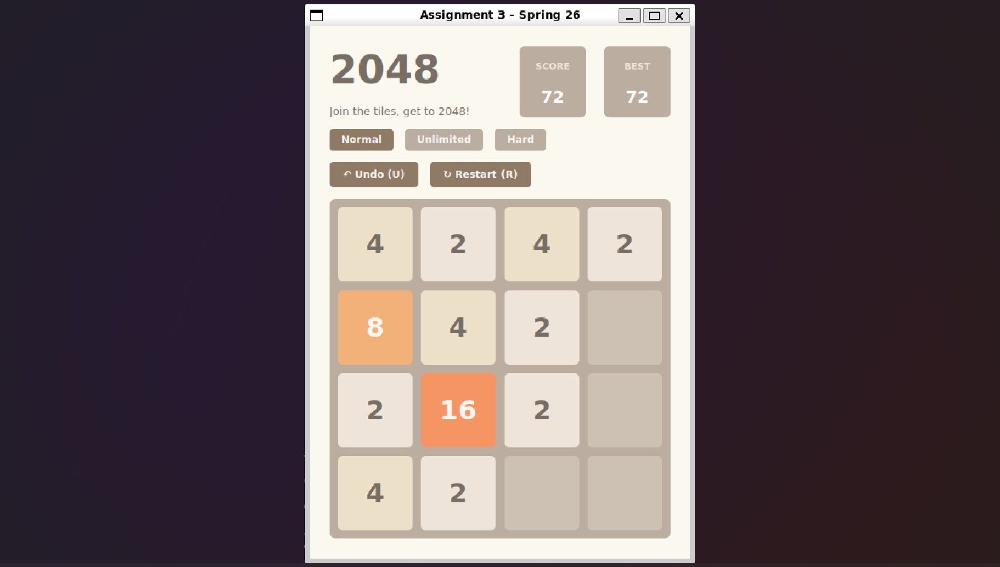

# 2048 — Qt / C++

A desktop clone of the classic **2048** puzzle game, written in modern C++17 with Qt 6 Widgets.
It adds two extra game modes and full undo history. It also runs in the browser: GitHub Actions compiles it to WebAssembly and publishes it to GitHub Pages.

**▶ Play online:** [melihefesonmez.github.io/2048-Game](https://melihefesonmez.github.io/2048-Game/)


<p align="center">
  
</p>

---

## Features

- **Classic 2048 gameplay**: slide tiles, merge equal numbers and reach the 2048 tile.
- **Three game modes**, which you can switch mid-game without losing the board or score:
  | Mode | Description |
  |------|-------------|
  | **Normal** | Standard rules. The game ends when you reach 2048. |
  | **Unlimited** | Keep playing past 2048 to chase higher tiles. |
  | **Hard** | If you don't move within **5 seconds**, the game makes a random valid move for you. A live countdown is shown on screen. |
- **Unlimited undo**: every move stores a snapshot of the board and score, so you can step back as many times as you like.
- **Score & best score** tracking for the session.
- **Win / game-over overlay** with context-aware actions (*Keep going*, *Play Again*, *Try Again*).
- **Configurable rules**: grid size, target tile and the 2/4 spawn probabilities are all compile-time constants, checked with `static_assert`.
- **Original look and feel**: tile colours and font sizes adapt to the tile value.

## Controls

| Key | Action |
|-----|--------|
| `↑ ↓ ← →` or `W A S D` | Slide tiles |
| `U` | Undo |
| `R` | Restart |

## Architecture

The project uses a clear **model / view separation**:

```
src/
├── main.cpp         # Application entry point
├── gamelogic.h/.cpp # Model: pure C++ game rules, no Qt dependency
└── mainwindow.h/.cpp# View + controller: Qt UI, input handling, timers
```

- **`GameLogic`** is a self-contained, UI-agnostic engine. It handles sliding and merging, random tile spawning (`std::mt19937`), scoring, undo history, win detection and valid-move detection. It only uses the standard library, so it can be unit-tested or reused with a different front end.
- **`MainWindow`** renders the board as a grid of styled `QLabel`s and turns keyboard and button events into moves. It also runs the mode logic and the Hard-mode timers. All game rules live in `GameLogic`.

### Implementation highlights

- **One slide routine for all four directions.** Each row or column is read into a line oriented in the direction of the move, then collapsed and merged by a single `slideAndMergeLine` function. The result is written back in the same order.
- **Invalid moves are rejected cleanly.** If nothing on the board changes, the move is rolled back. No tile spawns and no undo entry is recorded.
- **Valid-move detection by simulation.** Each direction is tried on a copy of the game. The game-over check and Hard mode's random auto-move both reuse this, so Hard mode never picks an invalid move.

## Build & Run

### Requirements
- C++17 compiler (GCC, Clang or MSVC)
- Qt 6 (Widgets module)
- CMake ≥ 3.21

### Desktop

```bash
cmake -S . -B build
cmake --build build
./build/2048
```

Or use the helper script:

```bash
./scripts/verify_build.sh
```

> If CMake cannot find Qt, pass its path explicitly, e.g.
> `cmake -S . -B build -DCMAKE_PREFIX_PATH=/path/to/Qt/6.x.x/<compiler>`

### WebAssembly

On every push to `main`, the workflow in [`.github/workflows/deploy-wasm.yml`](.github/workflows/deploy-wasm.yml):

1. installs Qt 6.9 for WebAssembly and the Emscripten SDK,
2. builds the project with `qt-cmake`,
3. deploys the generated `.html` / `.js` / `.wasm` files to **GitHub Pages**.

To enable it on your fork, go to **Settings → Pages** and set the source to **GitHub Actions**.

## Configuration

Game parameters are defined at the top of [`src/mainwindow.cpp`](src/mainwindow.cpp):

```cpp
constexpr int N = 4;     // rows
constexpr int M = 4;     // columns
constexpr int K = 2048;  // target tile
constexpr int P = 90;    // % chance a new tile is 2
constexpr int Q = 10;    // % chance a new tile is 4
```

Change them and rebuild to play on a 5×5 board, aim for 4096, and so on.

## Authors

- **Melih Efe Sönmez**: [@MelihEfeSonmez](https://github.com/MelihEfeSonmez)
- **İlhan Altınay**: [@Qorzy](https://github.com/Qorzy)

Developed as a course project for *CMPE 230 – Systems Programming* at Boğaziçi University (Spring 2026).
